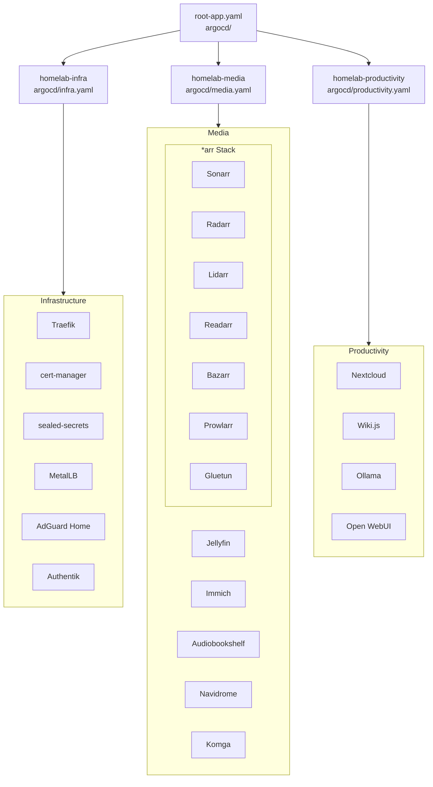
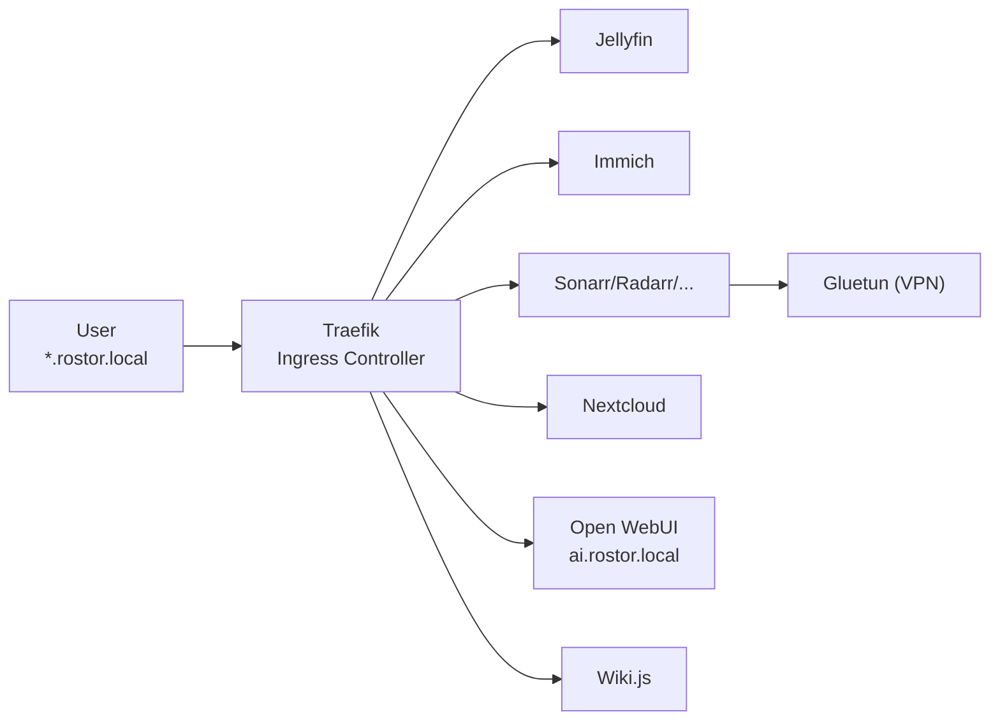

# Architecture

## Overview

This is a single-node Kubernetes homelab managed entirely through GitOps. Every resource in the cluster is defined in this repository. A push to `main` triggers an automatic sync via ArgoCD — no manual `kubectl apply` needed after the initial bootstrap.

## App-of-Apps Pattern

ArgoCD deploys a three-layer hierarchy:



### Layer 1 — Root App

File: [`argocd/root-app.yaml`](argocd/root-app.yaml)

A single ArgoCD `Application` that watches the `argocd/` directory. This is the only resource applied manually (`kubectl apply`). It deploys three category-level apps.

### Layer 2 — Category Apps

- [`argocd/infra.yaml`](argocd/infra.yaml) → deploys everything in `apps/infra/`
- [`argocd/media.yaml`](argocd/media.yaml) → deploys everything in `apps/media/`
- [`argocd/productivity.yaml`](argocd/productivity.yaml) → deploys everything in `apps/productivity/`

Each is an ArgoCD `Application` pointing at a kustomization in `apps/<category>/`. ArgoCD recursively reconciles all manifests found there.

### Layer 3 — Individual Apps

Each app is defined by:
- An ArgoCD `Application` manifest (`<app>-app.yaml`)
- Helm `values.yaml` if applicable
- Support resources (PVCs, PVs, ConfigMaps, secrets)

Apps using external Helm charts (Jellyfin, Immich, etc.) use `helm.valueFiles` to reference their values from this repo. The *arr stack uses [bjw-s app-template](https://github.com/bjw-s/helm-charts) for consistent Helm deployment.

## Helm Chart Sources

| Registry | Services |
|---|---|
| `oci://ghcr.io/bjw-s-labs/helm/app-template` | Sonarr, Radarr, Lidarr, Readarr, Bazarr, Prowlarr, Gluetun |
| `oci://ghcr.io/immich-app/immich-charts/immich` | Immich |
| `https://jellyfin.github.io/jellyfin-helm` | Jellyfin |
| `https://christianhuth.github.io/helm-charts` | Audiobookshelf |
| `https://repo.helmforge.dev` | Komga |
| `oci://oci.trueforge.org/truecharts/navidrome` | Navidrome |
| `https://helm.traefik.io/traefik` | Traefik |
| `https://prometheus-community.github.io/helm-charts` | kube-prometheus-stack (disabled) |
| `https://grafana.github.io/helm-charts` | Loki, Grafana (disabled) |
| `https://nextcloud.github.io/helm/` | Nextcloud |
| `https://charts.js.wiki` | Wiki.js |

## Networking



- **Ingress controller**: Traefik v3 with both Kubernetes Ingress and CRD providers.
- **Hostnames**: `*.rostor.local` (local DNS via router/Pi-hole, no public DNS).
- **TLS**: self-signed certificates via cert-manager.
- **Load balancer**: MetalLB provides the ingress IP.
- **VPN**: The *arr stack routes through Gluetun for indexer/usenet access.

## Storage

### NFS Media Storage

All media-heavy apps mount an NFS share from a Synology NAS:

```
Path: /volume2/proxmox2/Media
Mount: /data
Protocol: NFSv4.1
```

Each app has a dedicated PV/PVC pair:

| App | PV Name | PVC Name | Namespace |
|---|---|---|---|
| Jellyfin | `nfs-media-jellyfin` | `media-nfs-pvc` | jellyfin |
| Immich | `nfs-media-immich` | `media-nfs-pvc` | immich |
| Audiobookshelf | `nfs-media-audiobookshelf` | `media-nfs-pvc` | audiobookshelf |
| Navidrome | `nfs-media-navidrome` | `media-nfs-pvc` | navidrome |
| Komga | `nfs-media-komga` | `media-nfs-pvc` | komga |
| Sonarr | `nfs-media-sonarr` | `media-nfs-pvc` | sonarr |
| Radarr | `nfs-media-radarr` | `media-nfs-pvc` | radarr |
| Lidarr | `nfs-media-lidarr` | `media-nfs-pvc` | lidarr |
| Readarr | `nfs-media-readarr` | `media-nfs-pvc` | readarr |
| Bazarr | `nfs-media-bazarr` | `media-nfs-pvc` | bazarr |
| Prowlarr | `nfs-media-prowlarr` | `media-nfs-pvc` | prowlarr |

### Config Storage

App config lives on `local-path` PVCs (the default StorageClass), backed by the node's local disk. These are ephemeral — a node reboot wipes them. Back up important configs with `scripts/backup-arr-configs.sh`.

## Secrets

Secrets are encrypted with [Bitnami Sealed Secrets](https://github.com/bitnami-labs/sealed-secrets). Encrypted `SealedSecret` manifests live alongside each app in `apps/<category>/<app>/`. The cluster's sealed-secrets controller decrypts them at sync time — no unencrypted secrets are ever stored in the repo.

Encrypted secrets exist for:
- Immich (Postgres credentials)
- Authentik (secret key, bootstrap creds, Postgres password)
- Grafana (admin password)
- Loki (S3 access keys)
- RustFS (S3 access keys)

## Known Issues

- **Inotify limits**: Jellyfin on NFS hits `fs.inotify.max_user_instances`. Fixed by setting `DOTNET_USE_POLLING_FILE_WATCHER=1`.
- **NFS permissions**: NFS UID/GID must match on the Synology side. `chown -R 1000:1000` on the export root resolves write issues for the *arr apps.
- **Ephemeral local storage**: Config PVCs use `local-path`. Recreate configs from scratch after a node reboot if no backup was taken.
- **ArgoCD destination namespaces**: `argocd/infra.yaml` and `argocd/productivity.yaml` use `namespace: default` in their destination, which means all infra/productivity apps deploy to their own namespaces but are managed under the `default` destination server namespace scope.

## Adding a New App

1. Create `apps/<category>/<appname>-app.yaml` (ArgoCD Application manifest).
2. If Helm overrides are needed, create `apps/<category>/<appname>/values.yaml` and reference it with `helm.valueFiles`.
3. Add the app to the category's `kustomization.yaml`.
4. Push to `main`. ArgoCD picks it up on the next sync cycle.
5. No manual `kubectl apply` needed.

## Bootstrap (Fresh Cluster)

```bash
# 1. Install ArgoCD
kubectl create namespace argocd
kubectl apply -n argocd -f https://raw.githubusercontent.com/argoproj/argo-cd/stable/manifests/install.yaml

# 2. Wait
kubectl wait -n argocd --for=condition=Ready pods --all --timeout=5m

# 3. Bootstrap
kubectl apply -f argocd/root-app.yaml

# 4. Untaint control plane if single-node
kubectl taint nodes --all node-role.kubernetes.io/control-plane-
```

For sealed-secrets bootstrap (first time only):

```bash
# Install the controller
kubectl apply -f apps/infra/sealed-secrets-app.yaml
```